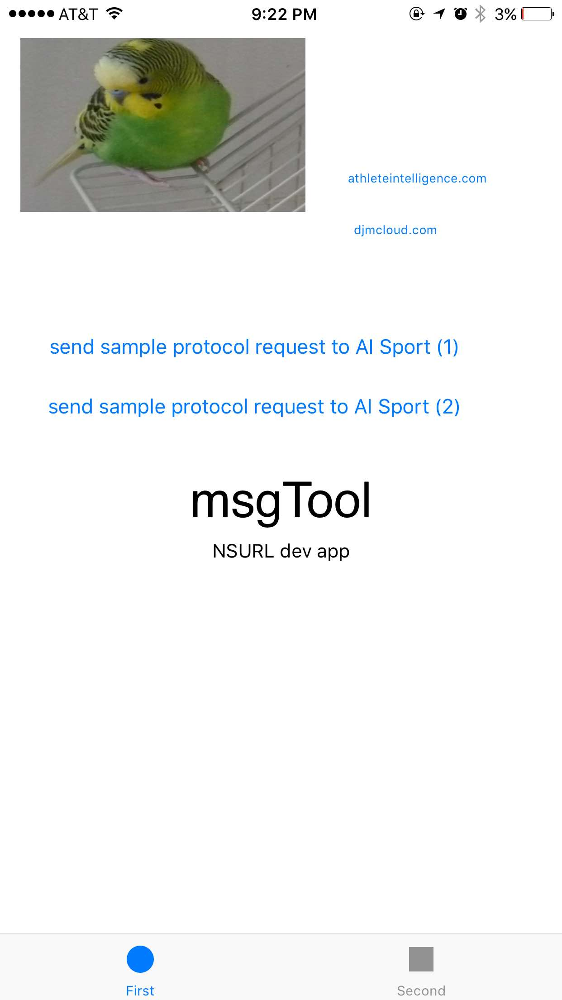
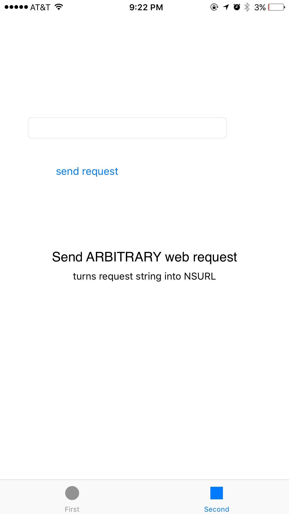

msgTool
======

## an iOS NSURL app for creating GET requests
##### from [Dan McKeown](http://danmckeown.info) and [Athlete Intelligence](https://athleteintelligence.com)
##### August 2017

### Features
- send test URL requests to aipsort:// protocol on tab 1
- send GET requests using NSURL based on user input on tab 2

### Requirements
- [Xcode](https://developer.apple.com/xcode/)

### Screenshots

* * *

